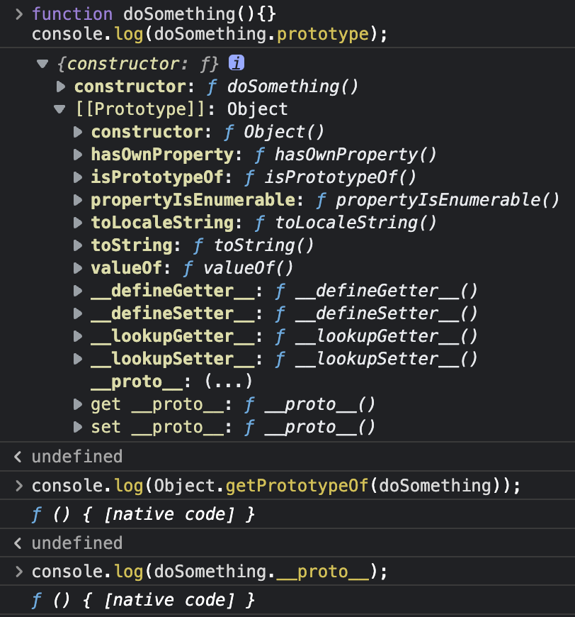
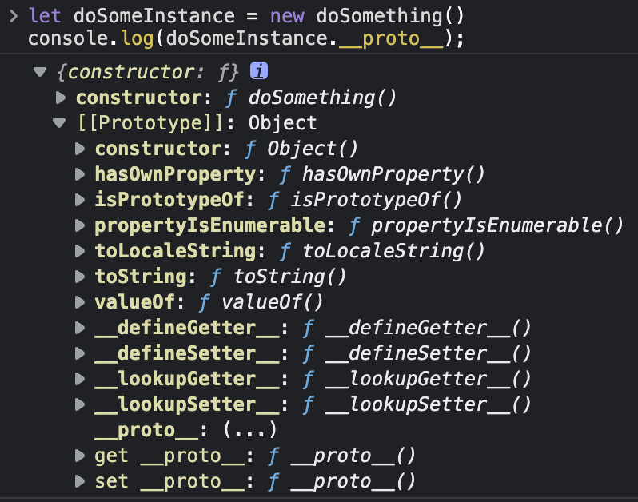
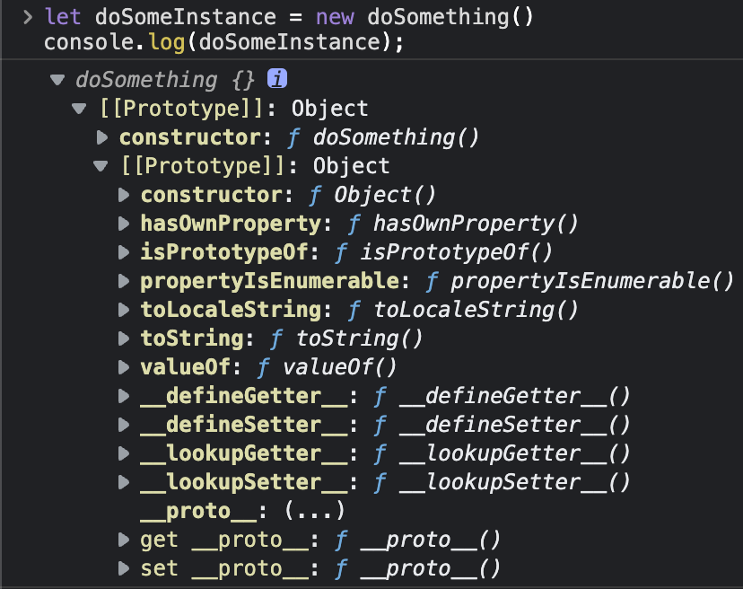
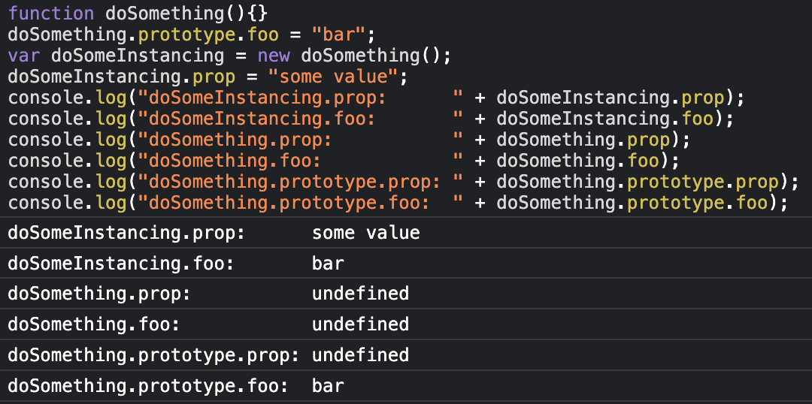

[js的prototype](https://developer.mozilla.org/zh-CN/docs/Learn/JavaScript/Objects/Object_prototypes)

以下内容都是从https://developer.mozilla.org/zh-CN/docs/Learn/JavaScript/Objects/Object_prototypes抄的。。。

JavaScript 常被描述为一种基于原型的语言 (prototype-based language)——每个对象拥有一个原型对象，对象以其原型为模板、从原型继承方法和属性。原型对象也可能拥有原型，并从中继承方法和属性，一层一层、以此类推。这种关系常被称为原型链 (prototype chain)，它解释了为何一个对象会拥有定义在其他对象中的属性和方法。

准确地说，这些属性和方法定义在 Object 的构造器函数 (constructor functions) 之上的prototype属性上，而非对象实例本身。

>备注： 理解对象的原型（可以通过Object.getPrototypeOf(obj)或者已被弃用的__proto__属性获得）与构造函数的prototype属性之间的区别是很重要的。前者是每个实例上都有的属性，后者是构造函数的属性。也就是说，Object.getPrototypeOf(new Foobar())和Foobar.prototype指向着同一个对象。

***前者是每个实例都有的属性，后者是构造函数的属性。*** 还是有区别的。看了这段话我并没有完全理解，看一下下面代码。
```js
function doSomething(){}
console.log(doSomething.prototype);
console.log(Object.getPrototypeOf(doSomething));
console.log(doSomething.__proto__);
```
输出：



可以看到prototype和__proto__属性是不一样的。    
constuctor function在prototype下面。

再看一个例子。
```js
let doSomeInstance = new doSomething()
console.log(doSomeInstanc.__proto__);
```
输出：


`doSomeInstance`是`doSomething`的实例。可以看到实例的`__proto__`属性 和 类的`prototype`属性是一样的。实例没有`constructor function`，也没有`prototype`属性。

好了，这里主要要分清`__proto__`和`prototype`。这下再看前面，***js的方法和属性继承是基于`__proto__`的。***, 实例通过`__proto__`属性和类建立连接。

下面这个我有点点没搞懂为什么和上面有点点区别。



下面这个就很好分析了。上面我们已经看到实例的`__proto__`和类的`prototype`是一样的。所以实例的`foo`属性有值。而类的`__proto__`不等同于类的`prototype`，所以`doSomething`的`foo`属性没值。

